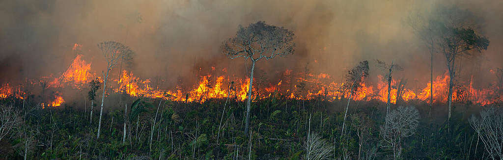
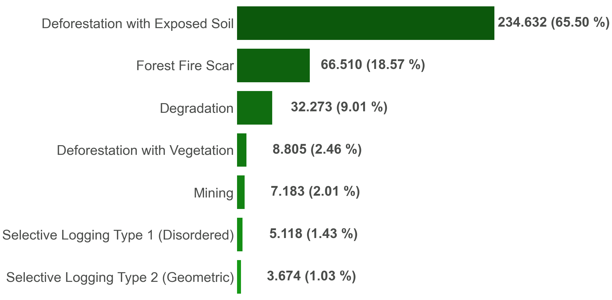
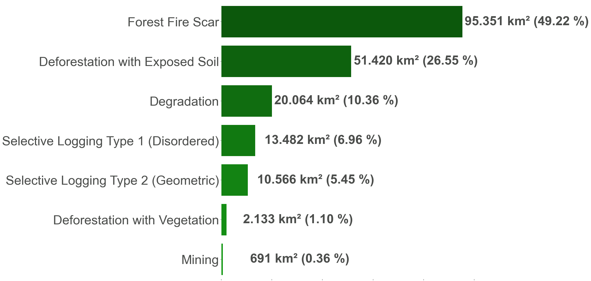
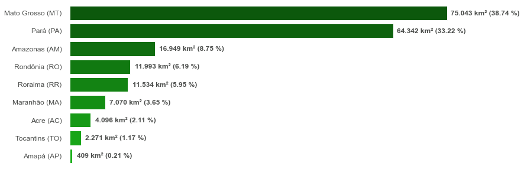
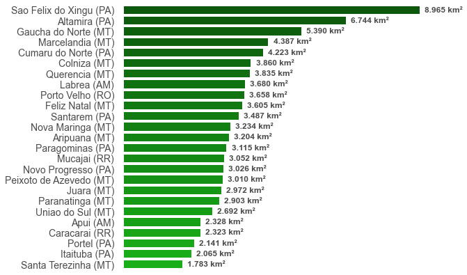
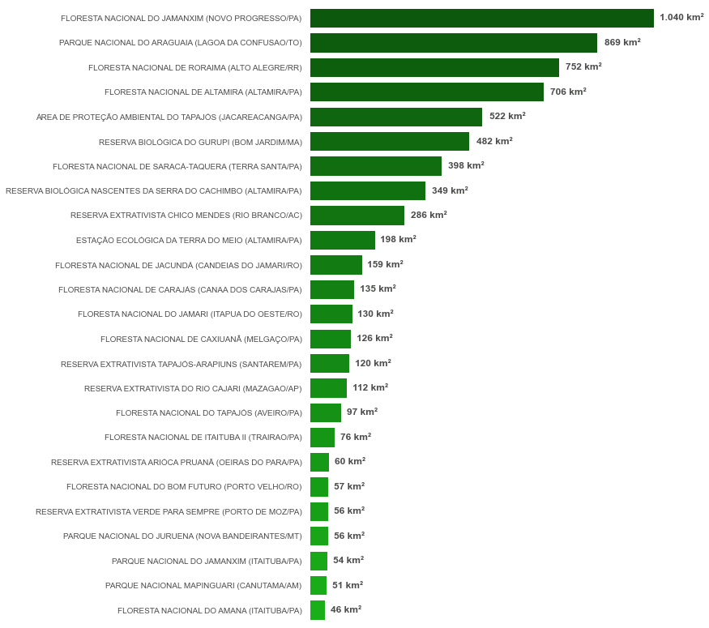
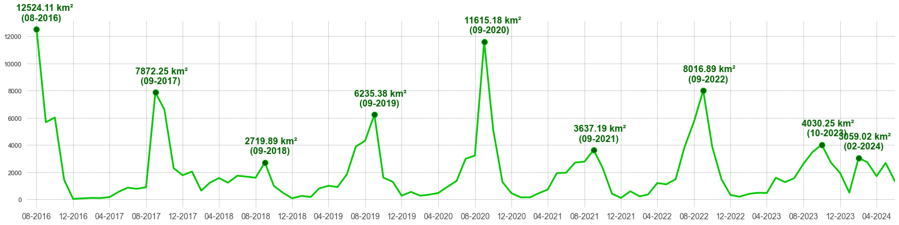
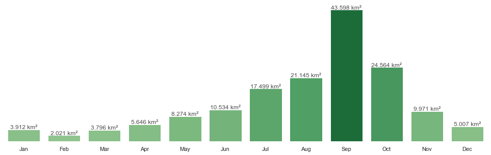
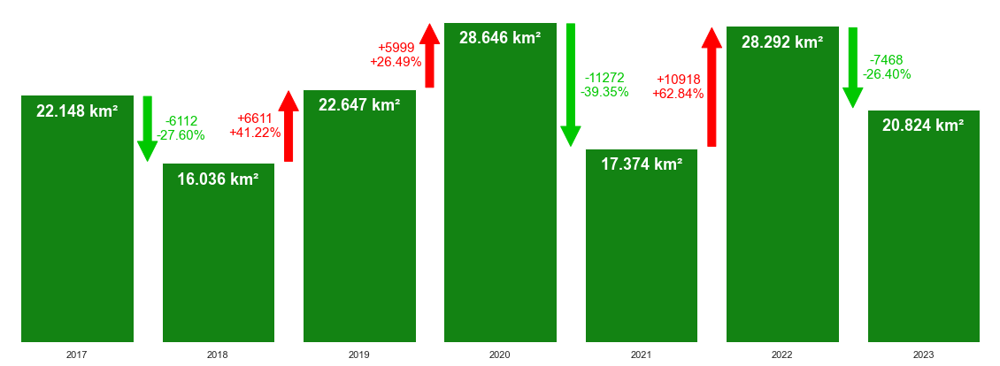

# Real-Time Deforestation Detection - INPE Data Analysis
The DETER system, short for "Real-Time Deforestation Detection", is a system developed by the Brazilian National Institute for Space Research (INPE), aimed at monitoring and identifying changes in forest cover within the Legal Amazon in Brazil. This system is essential for environmental enforcement and combating illegal deforestation, providing crucial data for prevention and control actions. Through high-resolution satellite images, DETER can detect areas of deforestation and forest degradation with high precision and almost in real-time. This information is made available periodically, allowing for a swift response from environmental authorities.

This project aims to analyze DETER data to monitor and visualize deforestation in the Legal Amazon. Geoprocessing and data visualization libraries were used to create charts and maps that show the extent and distribution of deforestation, facilitating the understanding of patterns and trends. 

The project was developed using Streamlit and is available at [this link](https://inpe-data-analysis.streamlit.app/).

### Project Details

1. **Data Sources**:
   - **DETER Alerts**: Deforestation alert data provided by INPE, available in shapefile and CSV formats. Available at [TerraBrasilis](https://terrabrasilis.dpi.inpe.br/downloads/).
   - **IBGE Regional Meshes**: Geospatial data from IBGE. Available at [IBGE](https://www.ibge.gov.br/geociencias/organizacao-do-territorio/malhas-territoriais/15774-malhas.html).

2. **Libraries**:
   - **Pandas**: Library for tabular data analysis.
   - **Geopandas**: Library for geospatial data manipulation.
   - **Matplotlib and Seaborn**: Libraries for creating static charts.
   - **Folium**: Library for creating interactive maps.
   - **Streamlit**: Platform for building interactive web applications.

3. **Project Components**:
   - **Jupyter Notebooks**: Scripts for data processing and visualization.
     - `Graphs_DETER.ipynb`: Contains functions to generate charts of deforestation classes, occurrence counts, and other statistics.
     - `Maps_DETER.ipynb`: Contains functions to generate interactive maps showing the geographical distribution of deforestation alerts.
   - **Streamlit Application**: Web interface for interactively visualizing charts and maps.
     - `app.py`: Main script that sets up the page, downloads necessary data, loads texts in different languages, and organizes the visualization sections.

4. **Visualizations**:
   - **Charts**:

<table>
  <tr>
    <td></td>
    <td></td>
    <td></td>
    <td></td>
  </tr>
  <tr>
    <td>Occurrence Counts by Class</td>
    <td>Deforestation by Class</td>
    <td>Deforestation by State</td>
    <td>Deforestation by Municipality</td>
  </tr>
  <tr>
    <td></td>
    <td></td>
    <td></td>
    <td></td>
  </tr>
  <tr>
    <td>Deforestation in Conservation Units</td>
    <td>Damage Over the Years</td>
    <td>Yearly Analysis</td>
    <td>Trend Analysis</td>
  </tr>
</table>

   - **Maps**: Interactive maps showing the location of deforestation alerts and their respective classes.
